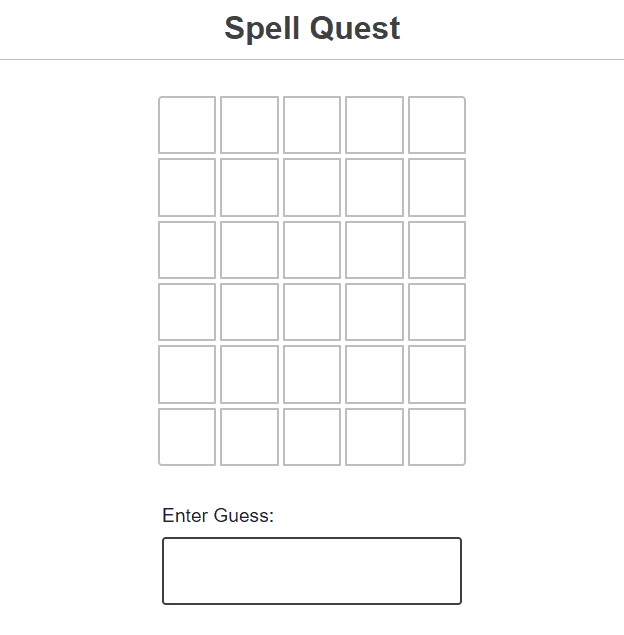
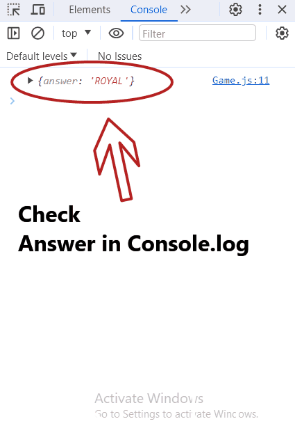

# SpellQuest ✨

Welcome to SpellQuest, the ultimate word-guessing game where players test their linguistic prowess by guessing the Word of the Day! Get ready to embark on a journey of words, challenges, and fun. Let the spelling adventure begin! 🚀

## Demo

Explore the SpellQuest interface and get a glimpse of the excitement with our interactive demo.

## Get Started

Ready to embark on the SpellQuest? Join now and let the spelling adventure unfold! 🎉

[Let's play the SpellQuest](https://spell-quest.vercel.app/)

## How to Play

1. **Join the Quest:** Sign up for SpellQuest and become a word warrior.

2. **Daily Challenge:** Every day, a new Word of the Day will be unveiled. Your mission, should you choose to accept it, is to guess the correct spelling of that word.

3. **Submit Your Guess:** Type in your guess and submit it to see if you're a spelling sorcerer or in need of a little linguistic training.

4. **Compete with Friends:** Challenge your friends to join the SpellQuest and see who can conquer the daily word challenges.

5. **Level Up:** As you progress, encounter tougher words and climb the ranks to become the ultimate word wizard.

## Features

- **Word Diversity:** SpellQuest features a vast array of words from different categories, ensuring a rich and varied gameplay experience.

### Ready to Spell?

Join the SpellQuest now and let the spelling adventure begin!

[Let's play the SpellQuest](https://spell-quest.vercel.app/)
